# Dokumentasi Diagram Sistem HerbaMed Jabar

Dokumen ini berisi analisis dan diagram sistem untuk aplikasi HerbaMed Jabar, sebuah aplikasi Android untuk identifikasi tanaman herbal menggunakan AI.

## Daftar Isi
1. [ERD (Entity Relationship Diagram)](#erd-entity-relationship-diagram)
2. [Diagram Konteks](#diagram-konteks)
3. [DFD Level 0](#dfd-level-0)
4. [DFD Level 1](#dfd-level-1)
5. [Flowmap Sistem](#flowmap-sistem)

---

## ERD (Entity Relationship Diagram)

ERD menunjukkan struktur data dan relasi antar entitas dalam sistem HerbaMed Jabar.

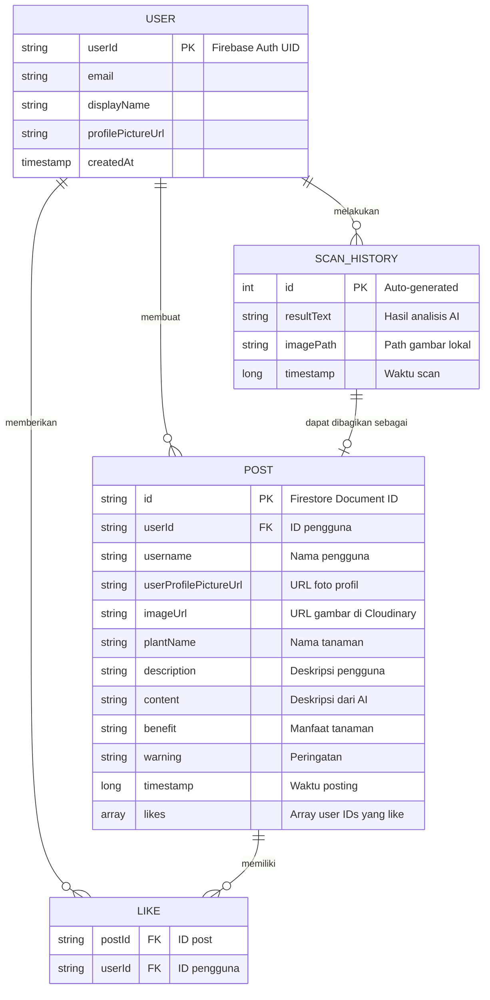

### Penjelasan Entitas:

1. **USER** (Firebase Authentication)
   - Dikelola oleh Firebase Authentication
   - Menyimpan informasi autentikasi dan profil pengguna
   - Mendukung login email/password dan Google Sign-In

2. **SCAN_HISTORY** (Room Database - Lokal)
   - Menyimpan riwayat pemindaian tanaman
   - Disimpan secara lokal di perangkat pengguna
   - Gambar disimpan di internal storage

3. **POST** (Firebase Firestore)
   - Menyimpan postingan forum pengguna
   - Gambar di-upload ke Cloudinary
   - Dapat dibuat dari hasil scan atau manual

4. **LIKE** (Embedded dalam POST)
   - Relasi many-to-many antara User dan Post
   - Disimpan sebagai array dalam dokumen Post

---

## Diagram Konteks

Diagram Konteks menunjukkan interaksi sistem dengan entitas eksternal.

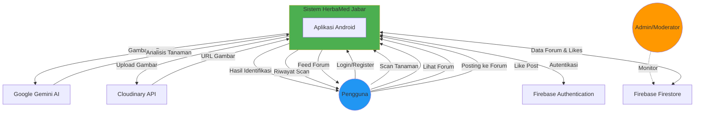

### Entitas Eksternal:

1. **Pengguna**: User utama yang menggunakan aplikasi
2. **Admin/Moderator**: Mengelola konten melalui Firebase Console
3. **Firebase Authentication**: Layanan autentikasi
4. **Firebase Firestore**: Database cloud untuk forum
5. **Cloudinary**: Layanan penyimpanan dan hosting gambar
6. **Google Gemini AI**: AI untuk analisis tanaman

---

## DFD Level 0

DFD Level 0 menunjukkan proses utama dalam sistem.

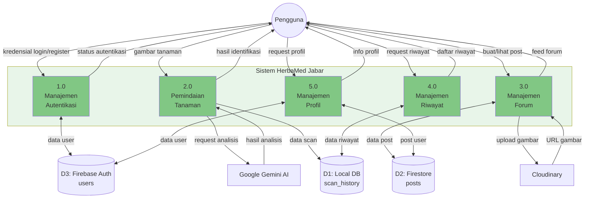

---

## DFD Level 1

### DFD Level 1.0 - Manajemen Autentikasi

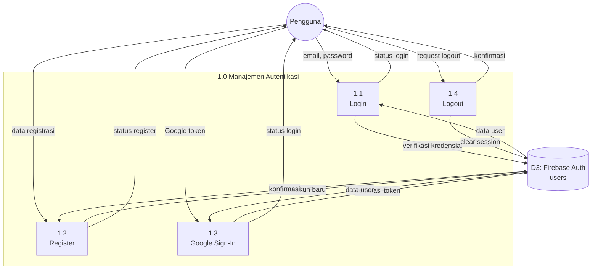

### DFD Level 1.1 - Pemindaian Tanaman

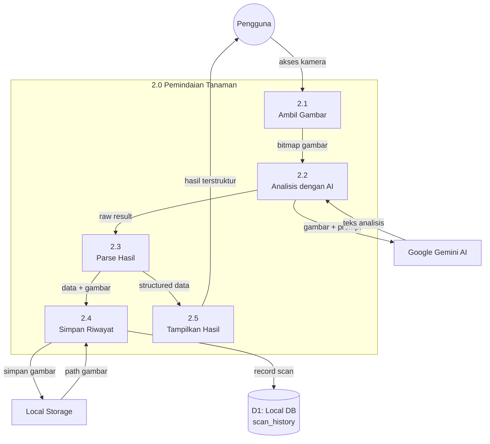

### DFD Level 1.2 - Manajemen Forum

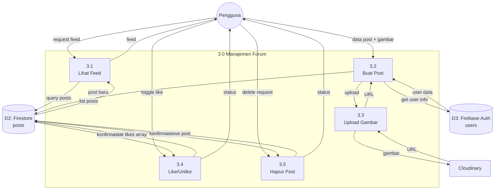

### DFD Level 1.3 - Manajemen Riwayat

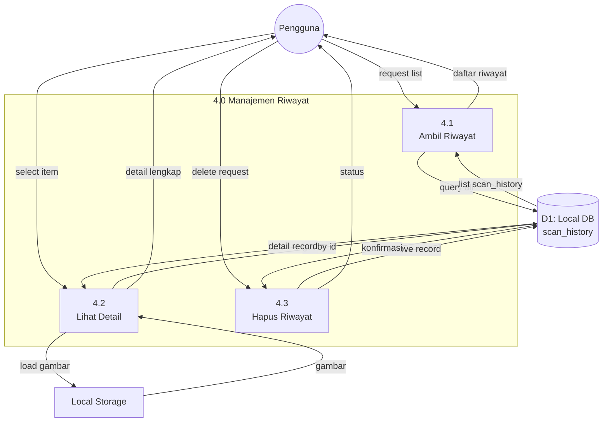

### DFD Level 1.4 - Manajemen Profil

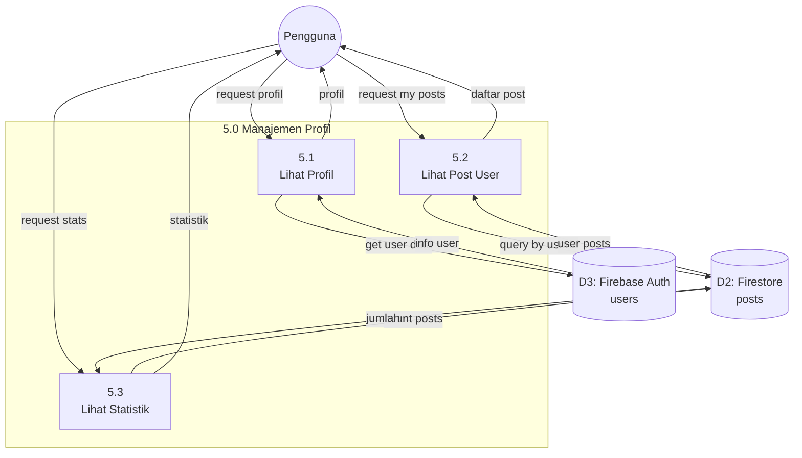

---

## Flowmap Sistem

Flowmap menunjukkan alur interaksi pengguna dengan sistem secara keseluruhan.

### Flowmap 1: Alur Autentikasi

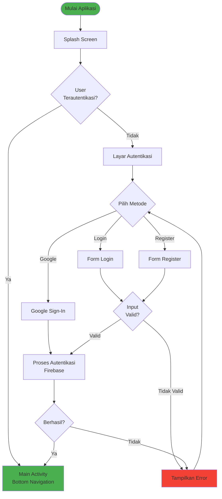

### Flowmap 2: Alur Pemindaian Tanaman

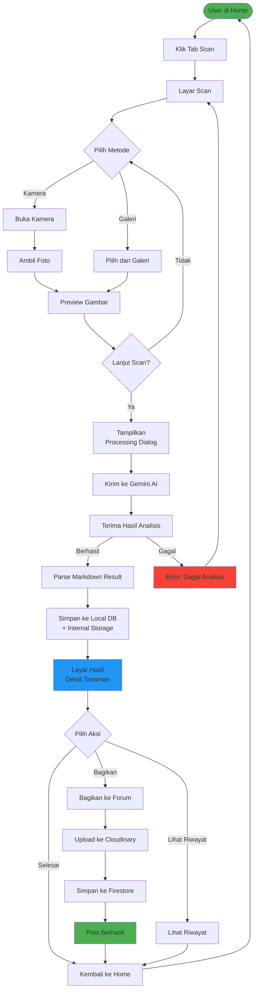

### Flowmap 3: Alur Forum

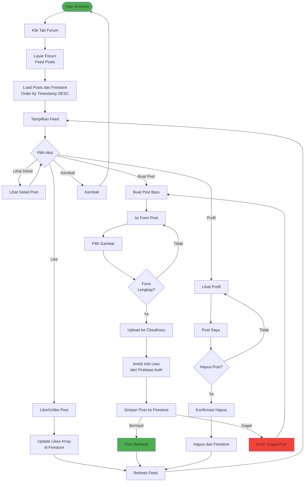

### Flowmap 4: Alur Riwayat

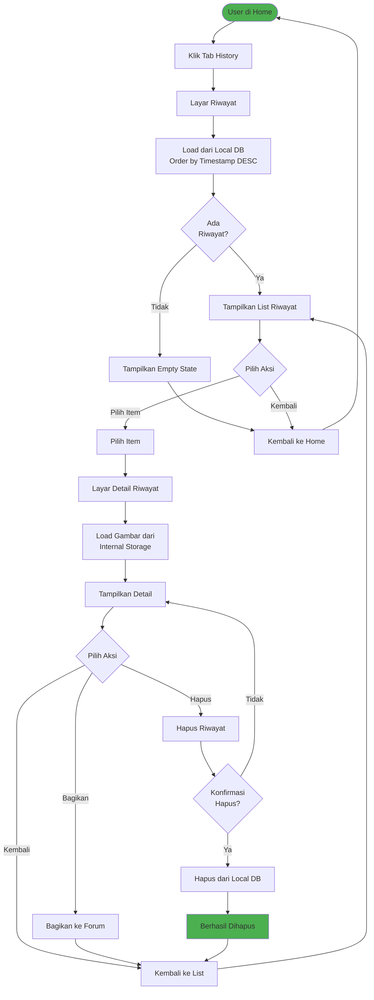

### Flowmap 5: Alur Profil

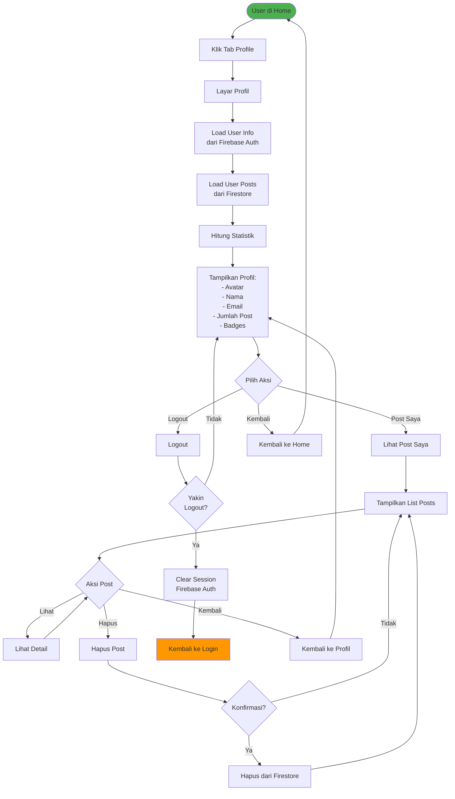

---

## Arsitektur Aplikasi

### Pola Arsitektur: MVVM (Model-View-ViewModel)

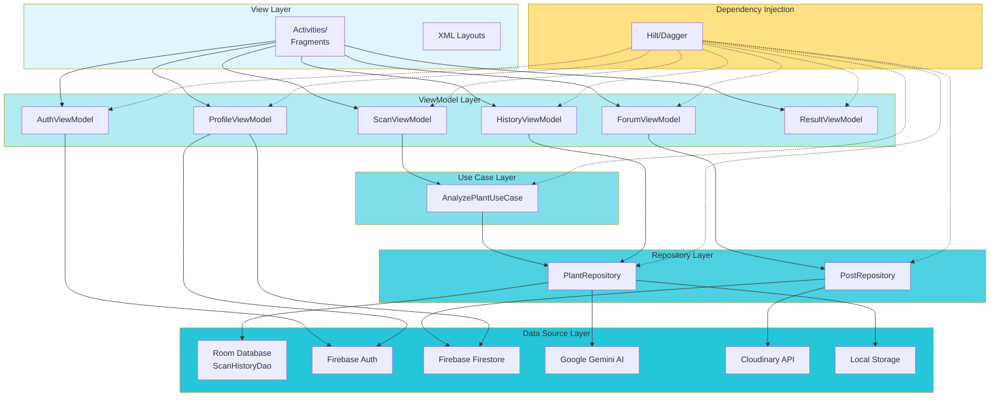

---

## Teknologi Stack

### Backend Services
- **Firebase Authentication**: Autentikasi pengguna (Email/Password, Google Sign-In)
- **Firebase Firestore**: Database NoSQL untuk data forum
- **Cloudinary**: Cloud storage untuk gambar forum
- **Google Gemini AI**: AI generatif untuk analisis tanaman

### Local Storage
- **Room Database**: Database SQLite untuk riwayat scan
- **Internal Storage**: Penyimpanan file gambar lokal

### Android Framework
- **MVVM Architecture**: Pola arsitektur aplikasi
- **Hilt**: Dependency injection
- **Coroutines**: Asynchronous programming
- **LiveData/Flow**: Reactive data streams
- **Navigation Component**: Navigasi antar fragment
- **CameraX**: API kamera modern
- **Coil**: Image loading library
- **Lottie**: Animasi

---

## Catatan Implementasi

1. **Data Persistence**:
   - Riwayat scan disimpan lokal menggunakan Room Database
   - Post forum disimpan di cloud menggunakan Firestore
   - Gambar scan disimpan di internal storage
   - Gambar forum di-upload ke Cloudinary

2. **Authentication Flow**:
   - Mendukung login dengan email/password
   - Mendukung Google Sign-In
   - Session dikelola oleh Firebase Auth

3. **AI Integration**:
   - Menggunakan Google Gemini 1.5 Flash model
   - Prompt terstruktur untuk hasil konsisten
   - Retry mechanism untuk menangani rate limiting

4. **Forum Features**:
   - Real-time updates menggunakan Firestore listeners
   - Like system dengan array manipulation
   - User dapat menghapus post sendiri

5. **Offline Support**:
   - Riwayat scan tersimpan lokal
   - Dapat dilihat tanpa koneksi internet
   - Forum memerlukan koneksi internet

---

**Dokumen ini dibuat berdasarkan analisis kode sumber HerbaMed Jabar**  
**Versi: 1.0**  
**Tanggal: 2025-12-15**
